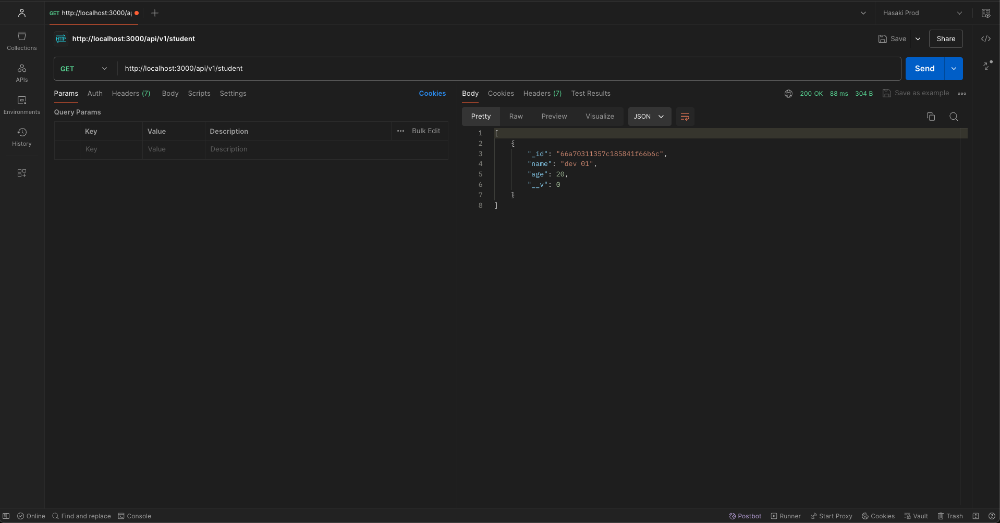
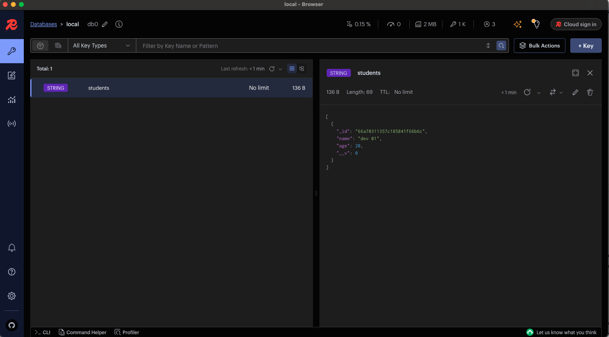
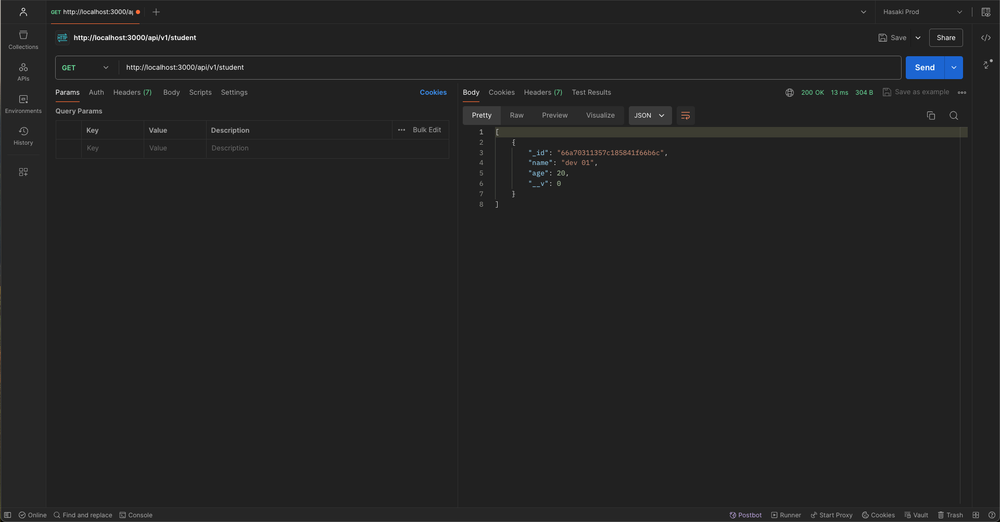

# Redis & Mongoose ExpressJS Demo

This is a demo application that uses Redis for caching and Mongoose for MongoDB integration with an ExpressJS server. The application provides basic CRUD operations with caching to `improve performance`.

## Table of Contents

- [Redis \& Mongoose ExpressJS Demo](#redis--mongoose-expressjs-demo)
  - [Table of Contents](#table-of-contents)
  - [Features](#features)
  - [Prerequisites](#prerequisites)
  - [Installation](#installation)
  - [Usage](#usage)
  - [API Endpoints](#api-endpoints)
    - [Create a new student](#create-a-new-student)
      - [Request Body](#request-body)
      - [Response](#response)
    - [Get all students](#get-all-students)
      - [Response](#response-1)
    - [Result](#result)
    - [Summary](#summary)
  - [Technologies](#technologies)

## Features

- Basic CRUD operations (Create, Read, Update, Delete) for student data
- Caching with Redis to `improve read performance`
- MongoDB integration using Mongoose

## Prerequisites

Before you begin, ensure you have met the following requirements:

1. Node.js and npm installed

    Check if you have Node.js installed by running this command:

    ```bash
    node -v
    ```

    Also, check if you have npm installed by running this command:

    ```bash
    npm -v
    ```

    If you don't have Node.js installed, you can download and install it from [here](https://nodejs.org/).
2. MongoDB installed and running
    You can download and install MongoDB from [here](https://www.mongodb.com/try/download/community).
3. Redis installed and running
    You can download and install Redis from [here](https://redis.io/download).

## Installation

1. Clone the repository:

    ```bash
    git clone https://github.com/trongpham99-cpu/Backend-Development-FW.git
    cd Backend-Development-FW/restful-apis-with-expressjs-mongodb-redis
    ```

2. Install dependencies:

    ```bash
    npm install
    ```

3. Set up your MongoDB and Redis connection strings in the `.env` file:

    ```bash
    APP_ENV=development
    APP_PORT=3000

    MONGODB_URI=mongodb://localhost:27017/restful-apis-with-expressjs-mongodb-redis
    REDIS_URI=redis://localhost:6379
    ```

## Usage

1. Start the server:

    ```bash
    npm start
    ```

2. The server will be running on `http://localhost:3000`.

## API Endpoints

### Create a new student

```http
POST /api/student
```

#### Request Body

```json
{
  "name": "John Doe",
  "age": 25
}
```

#### Response

```json
{
  "message": "User created successfully",
  "data": {
    "_id": "5f7b7b7b7b7b7b7b7b7b7b7b",
    "name": "John Doe",
  }
}
```

### Get all students

```http
GET /api/student
```

#### Response

```json
{
  "message": "Users retrieved successfully",
  "data": [
    {
      "_id": "5f7b7b7b7b7b7b7b7b7b7b7b",
      "name": "John Doe",
      "age": 25
    }
  ]
}
```

### Result

1. Get list of students with out cache
  
2. Get list of students with cache
  
  

### Summary

- The first request to get all students takes around `100ms`.
- The second request to get all students takes around `10ms`.

The performance of the third request is significantly better than the first request because the data is `cached in Redis`.

## Technologies

- [ExpressJS](https://expressjs.com/) - Fast, unopinionated, minimalist web framework for Node.js
- [Mongoose](https://mongoosejs.com/) - Elegant MongoDB object modeling for Node.js
- [Redis](https://redis.io/) - In-memory data structure store, used as a database, cache, and message broker